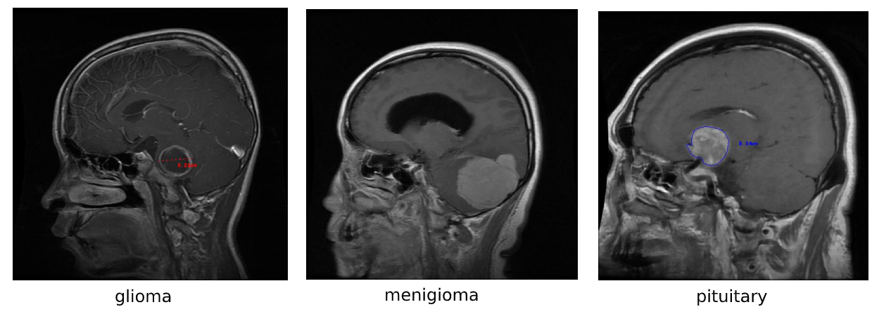
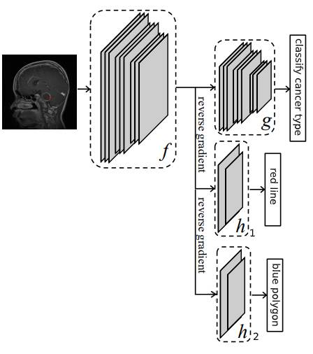

# Bias in medical imaging: dealing with cancer classification from MRI scans that contain biased properties

 

  

 
 

[Link to the experiments in this github](https://github.com/galprz/bias-in-medical-imaging/blob/master/experiments.ipynb)
 

# Intro
Machine learning models are gaining popularity in recent years due to their
capability of estimating almost any function given a large amount of training
data. One of the use cases for machine learning models in the field of medical
imaging is classifying MRI and CT scans to fully or partly automate the
diagnosis process. The common paradigm is to train deep learning models in
supervised fashion using labeled data that was already labeled by doctors.
While the quantity of the data is important, the quality of the data is also
affecting the performance of the models. If biased input is given in the
training phase, the model could perceive the biased properties as dominant
properties which could potentially lead to a classifier with poor performance.
This can become a major problem when doctors depend on those models to
decide the treatments of their patients. The training data often contain noise,
because it is not created specifically for machine learning models but to help
the doctors with the diagnosis task. In this paper, we will simulate the process
of learning from baised data.
# Paper
The report.pdf file contain the full report
# This repository
The focus of this repo is to implement the architecture suggested by Kim et al [Learning Not to Learn: Training Deep Neural Networks with Biased Data](https://arxiv.org/abs/1812.10352) and to adapt this to solve the bias problem for the case of classification of cancer in biased environment.

  

# Code structure
+ utils/ contains helpers to download unzip and visualize the data
+ the dataset.py encapsulate the brain_tumor_dataset into pytorch datasets and add the functionality of creating biased dataset with different probability for each bias.
+ models.py contain the implementation of the models.
+ train.py contain functionality of running train epoch.

# Experiments
One can use this [colab notebook](https://colab.research.google.com/drive/1_XXetCndX5BhR3UbL6-YlSIRMB821ek6?usp=sharing) to reproduce the results of the experiments.
Read the report.pdf to understand their context and settings.